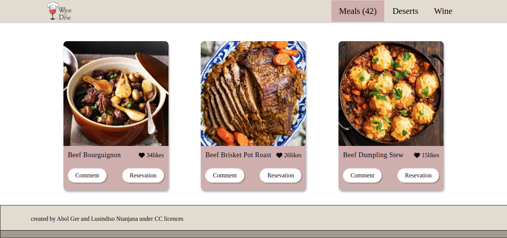

# Javascript Capstone

> This is a fictional website for Wine & Dine, a website where you can find different meals and share your views. It uses the  [MealDB API](https://www.themealdb.com/api.php)

## Built With

- HTML
- SCSS
- JavaScript
- Webpack
- Jest

## Link to the live page

> Feel free to check the [Live-site](https://lusindiso.github.io/Javascript-Capstone/).

## Authors

👤 **David Ger**

- GitHub: [@ger619](https://github.com/ger619)
- Twitter: [@abol_ger](https://twitter.com/ger_abol)
- LinkedIn: [David Ger](https://www.linkedin.com/in/david-ger-426b4576/)

👤 **Lusindiso Ntanjana**

- GitHub: [@Lusindiso](https://github.com/Lusindiso)
- Twitter: [@LusindisoNt](https://twitter.com/LusindisoNt)
- LinkedIn: [LinkedIn](https://www.linkedin.com/in/lusindisontanjana/)

## Acknowledgments

- Hat tip to anyone whose code was used
- Inspiration
- etc

## Video Link

> Here is a video link to our work (https://drive.google.com/file/d/15LNvD-5TcJutTbQ7SP69JQTDYTssRhOX/view?usp=sharing)

## 🤝 Contributing

Contributions, issues, and feature requests are welcome!

Feel free to check the [issues page](../../issues/).

## Show your support

Give a ⭐️ if you like this project!

## 📝 License

This project is [MIT](./MIT.md) licensed.

